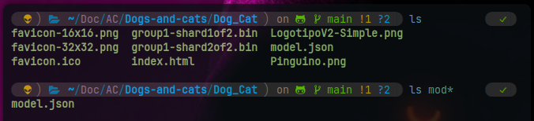

# Dogs-and-cats
Dog and cat classifier using CNN

Verifique el modelo generdo en .json



* 1: Para desplegar en un servidor local use python (debe estar en el directiorio del archivo index.html)

    ``` $ python -m http.server 8000 ```

* 2: Para que pueda usar en un smarphone
    Instale [ngrok](https://ngrok.com/) 
    Es necesario que inicie sesión para
    [Token de ngrok](https://dashboard.ngrok.com/get-started/setup/linux).

    * Intall
        Dependiendo del sistema operativo que use:\
        Linux:\
         ```$ snap install ngrok```
        
        Windows: 
        Puede descargar la version portabale o el .exe, en caso haya descargado la versión portable ejecute los comando ngrok desde el directorio de ngrok.\
        ```$ cd ngrok```
        
        Agregue el [Token de ngrok](https://dashboard.ngrok.com/get-started/setup/linux)\
        ```$ ngrok config add-authtoken <>```

* 3: Crear tunel:
    Para crear un tunel temporal ejecule uno de los comandos.

    ```$ ngrok http http://localhost:8080```

    ```$ ngrok http 8080```

    Esto le proveerá un link que puede usarlo en su smarphone. Debe escogoe un puerto disponible, en este caso es 8000